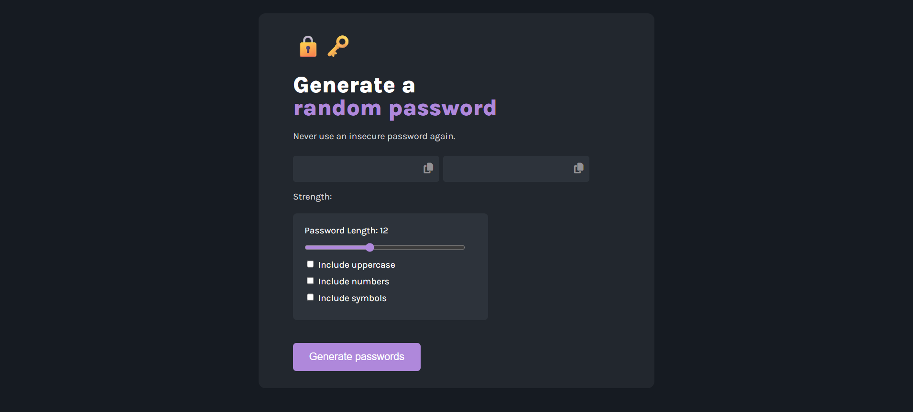
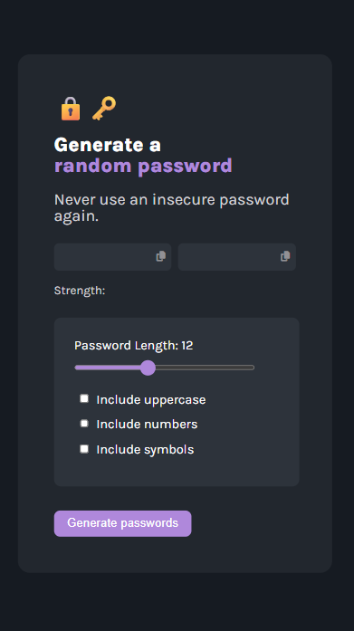

# 🔐 Random Password Generator

Generate secure and customizable passwords effortlessly with this simple and beautiful web app.

## 🚀 Live Demo

🔗 [Click here to try it out](https://vocal-puffpuff-4bb890.netlify.app)

---

## 📸 Screenshots

| Desktop | Mobile |
|--------|--------|
|  |  |

---

## 🧰 Features

- 🔄 Two independently generated passwords
- 🎚 Custom password length (10–15 characters)
- ✅ Toggle options: uppercase, numbers, symbols
- 📊 Strength meter with emojis 😎
- 📋 One-click copy to clipboard
- 💅 Responsive design for desktop & mobile

---

## 🛠 Tech Stack

- HTML5
- CSS3 (Flexbox + Media Queries)
- Vanilla JavaScript
- Google Fonts & Font Awesome

---

## 📦 How to Use Locally

1. **Clone the repo**
   ```bash
   git clone https://github.com/your-username/random-password-generator.git
   cd random-password-generator
   ```

2. **Open `index.html`** in any browser

---

## 🐛 Known Issues

- Copy confirmation message overwrites the password temporarily
- No persistent state or history of generated passwords

---

## 🧪 To-Do Enhancements

- [ ] Improve password strength evaluation
- [ ] Add dark/light mode toggle
- [ ] Export password list feature

---

## 📄 License

This project is licensed under the [MIT License](./LICENSE).

---

## 🙌 Credits

Made with 💜 by [Your Name] – inspired by security best practices.

---

## ⭐️ Show your support

Give this repo a ⭐ if you like it or fork it and build something awesome!